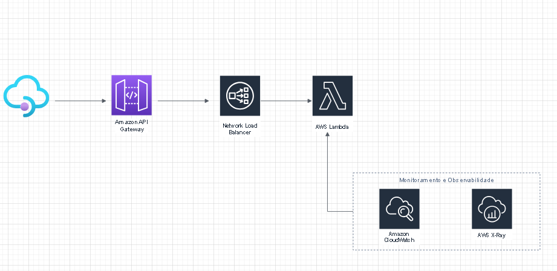
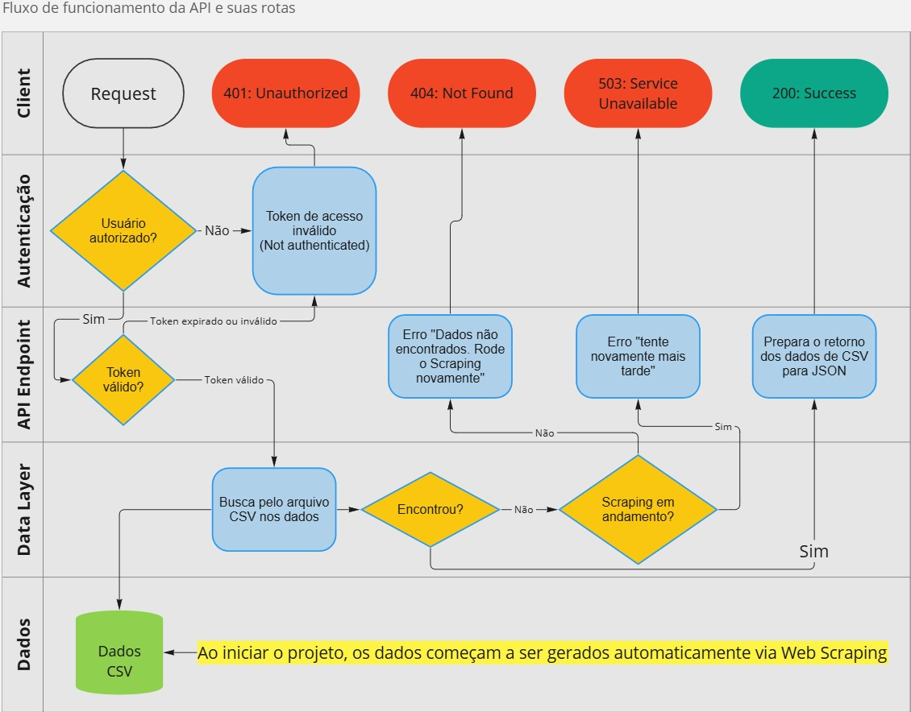

# API Consulta Dados Embrapa

Projeto para entrega do Tech Challenge do primeiro módulo da Pós em Machine Learning Engineering - FIAP.

## Como executar o projeto

### 1. Clone o repositório

```bash
  git clone https://github.com/Matheus-Chaves/api-consulta-dados-embrapa.git
```

### 2. Inicialize e ative o ambiente virtual

```bash
  python3 -m venv venv
  # Windows
  venv\Scripts\activate
  # Linux
  source venv/bin/activate
```

### 3. Instale as dependências do projeto

```bash
  pip install -r requirements.txt
```

### 4. Gere as Chaves Assimétricas

Para a autenticação usando JWT com chaves assimétricas, você precisa gerar um par de chaves RSA (privada e pública). Use os comandos abaixo:

```bash
  openssl genpkey -algorithm RSA -out private_key.pem -pkeyopt rsa_keygen_bits:2048
  openssl rsa -pubout -in private_key.pem -out public_key.pem
```

Certifique-se de que os arquivos `private_key.pem` e `public_key.pem` foram gerados na raiz do projeto. Eles devem conter os dados das chaves que serão utilizadas nas próximas etapas.

### 6. Inicialize o servidor da API

```bash
uvicorn src.main:app --reload
```

Após isso, sua documentação pode ser acessada via URL: `http://127.0.0.1:8000/docs` e os outros endpoints podem ser acessados normalmente.

### 7. **Opcional**: Rode o código para realizar o Web Scraping

```bash
python3 src/scraper.py
```

Como o Web Scraping é feito **junto com a inicialização da API**, não é necessário rodar o arquivo para realizar o processo de scraping.

## Testando a API

### 1. Testando via plataforma de testes de APIs (ex.: Postman, Insomnia, etc.)

#### Gere um Token JWT

1. Abra o app (ex.: Postman).
2. Crie uma nova requisição HTTP.
3. Configure a requisição:
   - Método: `POST`
   - URL: `http://127.0.0.1:8000/api/v1/auth/token`
   - Adicione um cabeçalho (Header):
     - Key: `accept`
     - Value: `application/json`
4. Envie a requisição.
5. Você deve receber uma resposta com um token JWT, semelhante a:

    ```json
    {
      "access_token": "SEU_TOKEN_JWT_GERADO",
      "token_type": "bearer"
    }
    ```

6. Copie o valor de `access_token`.

#### Use o Token para acessar um endpoint protegido

1. Crie uma nova requisição HTTP no Postman.
2. Configure a requisição:
    - Método: `GET`
    - URL: `http://127.0.0.1:8000/api/v1/producoes`
    - Adicione os cabeçalhos (Headers):
      - Key: `accept`
      - Value: `application/json`
      - Key: `Authorization`
      - Value: `Bearer SEU_TOKEN_JWT_GERADO`
        - Substitua `SEU_TOKEN_JWT_GERADO` pelo token que você copiou anteriormente.

3. Envie a requisição.

4. Você deve receber uma resposta semelhante a:

    ```json
    {
      "data": [
        {
          "id": 5,
          "id_pai": 3,
          "produto": "Nome do produto",
          "ano1_quantidade": "123.456.789",
          "ano2_quantidade": "123.456.789"
        }
      ]
    }
    ```

### 2. Testando via Swagger (documentação da API)

1. Acesse a URL `http://127.0.0.1:8000/docs`
2. Clique no botão **Authorize**
3. Irá aparecer um formulário com campos para serem preenchidos
    - Como não estamos utilizando um usuário real para realizar a autenticação, nenhum dado precisa ser preenchido;
    - Clique no botão "**Authorize**"
4. Irá aparecer uma modal informando que você está autorizado. Feche-a e siga para testar os endpoints
5. Clique em um endpoint, depois clique em **Try it out** e **Execute**. A resposta da requisição deve aparecer logo abaixo.

## Arquitetura do projeto

Pensando na parte futura do projeto, abaixo há a estrutura idealizada levando em consideração o uso dos serviços da AWS.



## Fluxo do projeto

1. API é inicializada junto com o processo de Web Scraping
    - Os dados irão para a pasta `/data` conforme o processo de scraping ocorre
    - Caso um arquivo já exista, ele irá ignorá-lo e pular para o próximo, evitando requisições desnecessárias ao site da Embrapa
    - Obs.: Para evitar um ataque DDoS acidental, cada requisição leva 1.5 segundos para acontecer
2. Todas as rotas são liberadas para receber requisições, não sendo bloqueadas pelo processo de Web Scraping, que ocorre via **threads**
3. Se a rota exigir autenticação, só poderá ser acessada passando o token JWT no cabeçalho da requisição
4. Ao acessar uma rota, seus respectivos dados serão retornados em JSON
    - No Swagger da API, há a documentação dos possíveis status code de retorno da rota, além de um exemplo de quando a requisição é bem sucedida.
5. Ao encerrar o app, os dados do scraping continurão salvos, facilitando a reinicialização do sistema.



## Planejamento do Deploy da API

### Etapa 1: Preparação do Ambiente

1. Configuração de Contas e Permissões:

    - Configurar uma conta AWS e acesso apropriado aos serviços necessários (API Gateway, Load Balancer, Lambda, CloudWatch e X-Ray).
    - Criar as policies necessárias e atribuídas às roles e usuários apropriados para garantir que cada serviço tenha as permissões corretas.

### Etapa 2: Implementação da Função AWS Lambda

1. Criação da Função Lambda:

    - Escrever o código para a função Lambda que implementa a lógica da aplicação.
    - Criar a função Lambda.
    - Configurar as variáveis de ambiente e definir o runtime (Python).
    - Atribuir uma role de execução que tenha permissões para qualquer serviço AWS que a função Lambda precisa acessar.

### Etapa 3: Configuração do Network Load Balancer

1. Criação do Network Load Balancer (NLB):

    - Criar um novo Network Load Balancer.
    - Configurar as definições básicas, como nome, esquema (interno ou internet-facing) e listeners.
    - Adicionar a função Lambda como destino do Load Balancer. Para isso, será necessário configurar a integração Lambda com o NLB.

### Etapa 4: Configuração do API Gateway

1. Criação do API Gateway:

    - Criar um novo API Gateway (REST ou HTTP API conforme necessário).
    - Definir os endpoints e métodos HTTP que serão usados para acessar a aplicação.
    - Configurar a integração do API Gateway com o Network Load Balancer criado na etapa anterior.
    - Definir as permissões necessárias para permitir que o API Gateway invoque o Load Balancer.

### Etapa 5: Implementação de Monitoramento e Observabilidade

1. Configuração do Amazon CloudWatch:

    - Configurar os logs do CloudWatch para a função Lambda e para o API Gateway.
    - Criar dashboards personalizados e configurar alarmes para monitorar métricas importantes (tempo de execução da Lambda, taxa de erros, latência do API Gateway, etc.).

2. Configuração do AWS X-Ray:

    - Ativar o tracing do AWS X-Ray para a função Lambda.
    - Configurar o API Gateway para enviar traces para o X-Ray.
    - Utilizar o console do X-Ray para visualizar e analisar as traces das solicitações, ajudando a identificar gargalos e problemas de desempenho.

### Etapa 6: Testes e Validação

1. Testes de Unidade e Integração:

    - Executar testes de unidade e integração no código Lambda para garantir que ele funcione corretamente.
    - Testar o fluxo completo de uma solicitação passando pelo API Gateway, Load Balancer e chegando à função Lambda.

2. Testes de Carga:

    - Realizar testes de carga para verificar como a aplicação se comporta sob alta demanda.
    - Utilizar ferramentas como AWS CloudWatch para monitorar o desempenho e ajustar configurações conforme necessário.

### Etapa 7: Implantação e Monitoramento Contínuo

1. Deploy:

    - Realizar o deploy da função Lambda e das configurações do API Gateway e Load Balancer.
    - Monitorar os logs e métricas iniciais para garantir que tudo esteja funcionando como esperado.

2. Monitoramento Contínuo e Manutenção:

    - Continuar monitorando a aplicação usando Amazon CloudWatch e AWS X-Ray.
    - Ajustar e otimizar conforme necessário, baseado nas métricas e logs coletados.

PS: Todos os recursos serão criados através de Infraestructure as Code, utilizando Terraform ou CloudFormation.

Seguindo essas etapas, será possível implantar a aplicação baseada na arquitetura apresentada, garantindo que todos os componentes estejam devidamente configurados e monitorados. Essa abordagem sistemática ajudará a minimizar problemas durante o deploy e a manter a aplicação estável e performática.

## Observações importantes

No momento atual do projeto, algumas coisas propositalmente não foram levadas em conta, pois futuramente pretendemos implementar de outra forma ou é um assunto ainda não abordado no curso, como por exemplo:

- Uso de algum banco de dados para guardar os dados do scraping;
- Real autenticação e criação de usuários;
- Melhorias no acesso dos endpoints, como:
  - Retornar resultados em cache;
  - Proteger as rotas contra acessos excessivos;
  - Entre outros
- Melhorias no Web Scraping, como:
  - Implementar 'retry' - tentar requisitar novamente caso uma rota dê erro
- Melhoria na arquitetura do repositório, implementando testes e deploy automatizado
